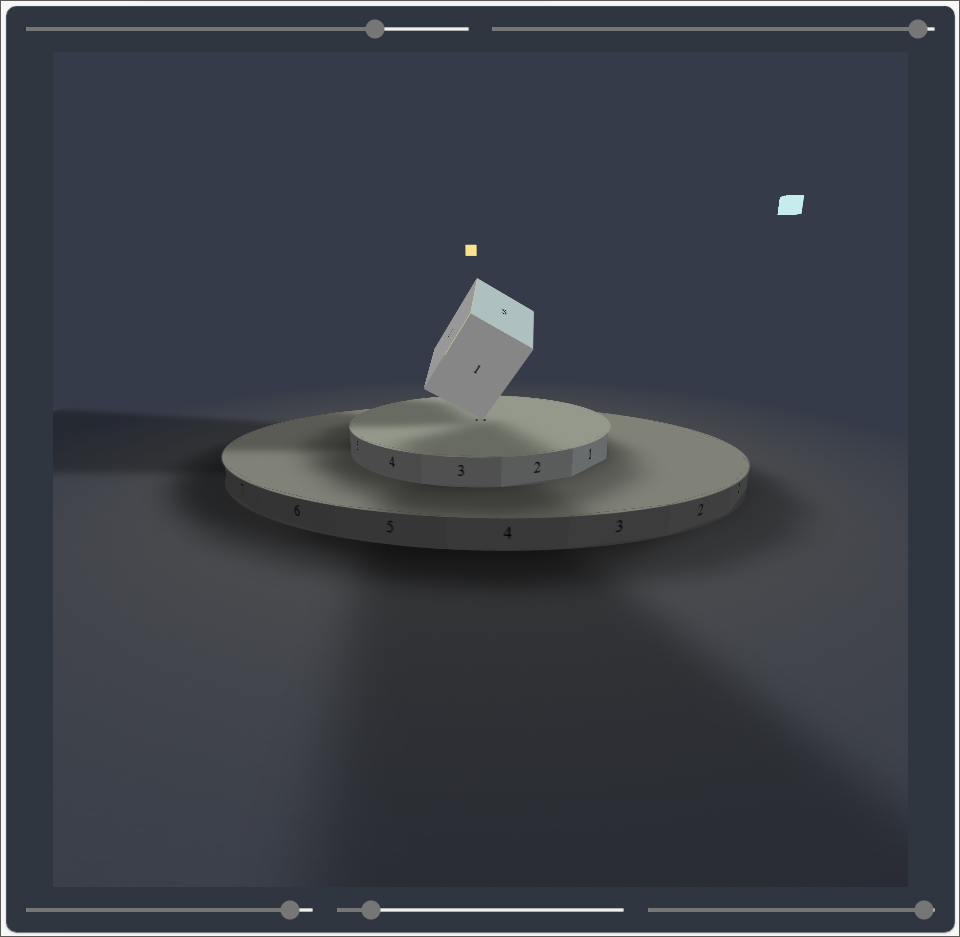
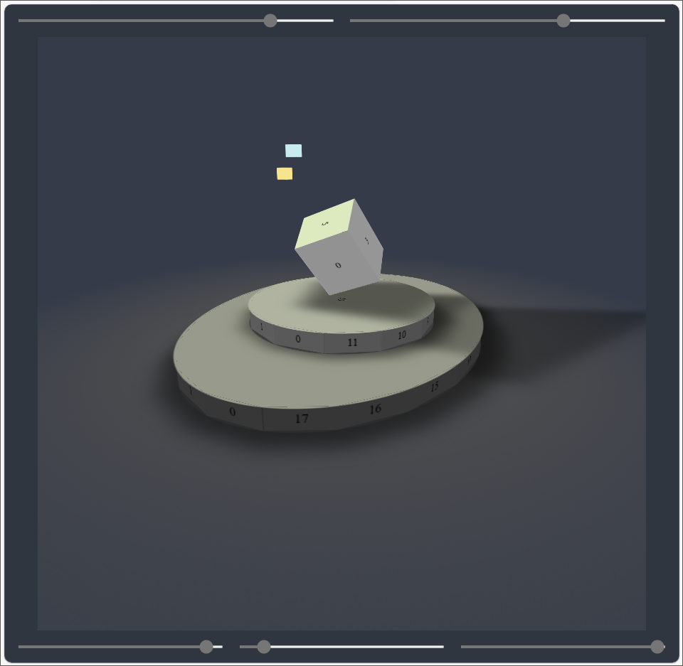
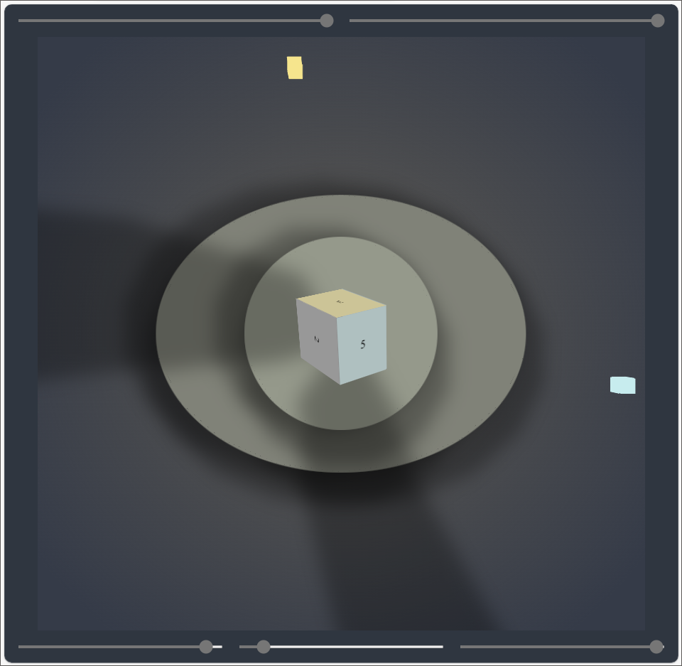
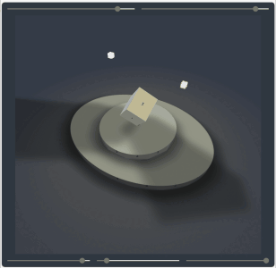
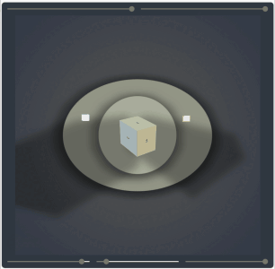

# 3D World Framework

	&#9;&#9;

This framework provides all the tools you need to create a 3D world in your browser, well, of course, within the limits the HTML, CSS, and JavaScript. You don’t need any fancy plugins or expensive dependencies; this framework is based on vanilla JavaScript and can be easily integrated into your projects. The following is a summary of its capabilities:
1. Creation of multiple 3D worlds on the same page;
2. Creation of multiple 3D objects;
3. Creation of multiple omni-directional lights;
4. Lighting calculation and shade creation;
5. And last, but not least, efficient shadow calculations;

But that’s not all that the 3D World Framework is capable of. It’s also designed to be interactive. You can move, rotate, resize objects or drag light sources around, while observing the real-time effects with the help of a super-fast physics calculation.  Just clone this repo or check out the following figures.

	&#9;

# Installation
All you need to do is adding following files to your project:
1. [haFunctions.js](haFunctions.js). It contains general functions required for physics calculations, e.g., `haFuncGetL2Norm` to compute the L2 norm of a vector or `haFuncLinearCombineVectors` to linearly combine vectors according to specified weights. The functions are quite descriptive and perform basic matrix operations that are not supported by the `Math` library.
2. [haAnimation.js]( haAnimation.js). It contains the `HaAnimation` class, which represents an animation wrapper around a vector. The animation can be controlled using `setVelocity` and `setDestination` methods dynamically. Other methods, such as `play`, `pause`, or `stop`, control the playback of the animation.
3. [ha3d.css](ha3d.css). It contains the basic CSS properties of a 3D world. Its content is better left unchanged, unless you really want to make some special modifications to the framework.
4. [ha3d.js]( ha3d.js). This JavaScript file is the heart of the 3D World Framework, where the actual magic happens. It contains multiple classes and functions used to create this framework. In the <a href="https://github.com/homayoun-afshari/ha-3d/blob/main/README.md#more-on-whats-happening-behind-the-scenes">last section</a>, I’ll explain them in more detail.

# Creation
In order to create a 3D world, first you need to create a 3D canvas, which is just a preferably empty `div` element labeled with `ha3d` as one its classes. That’s it, you now have a 3D canvas at your disposal! You can create as many 3D canvases as you want, as long as you properly define them inside your HTML code. Now, to add entities to a 3D canvas, you need to get it in JavaScript. At first, it may look like a simple DOM element, but that’s not even remotely what it’s capable of! This DOM element is now equipped with the following methods:
1. `makeHa3dWorld()`. With this method, you can now create a 3D world, which is in fact a JavaScript object that is an instance of the `Ha3dEntity` class.
2. `makeHa3dObject(type)`. It creates a 3D object inside your 3D world. The argument `type` specifies the type of the object that you want to create. The object itself is another JavaScript object that is also an instance of the `Ha3dEntity` class.

Now, as you might have guessed, you can use the methods of the `Ha3dEntity` class to manage a 3D world or a 3D object inside it. These methods are as follows:
1. `setFeatureValues(name, values, isControlled=false)`.
 - s
2. `setFeatureLimiter(name, externalLimiter)`.
3. `setFeatureControllers(name, domControllers)`.
4. `setEventListener(title, callback)`.
5. `unsetEventListener(title)`.
6. `setInteraction(targetFeatureName, parameters={})`.
7. `unsetInteraction()`.
8. `setFaceInnerHtml(faceIndex, innerHtml)`.
9. `unsetFaceInnerHtml()`.

The [main.js](main.js) file contains a sample of what I just explained.

# More On What’s Happening Behind the Scenes

